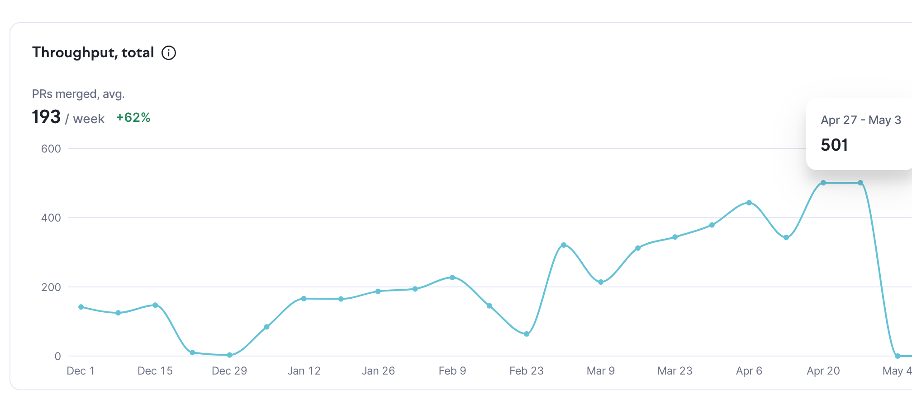
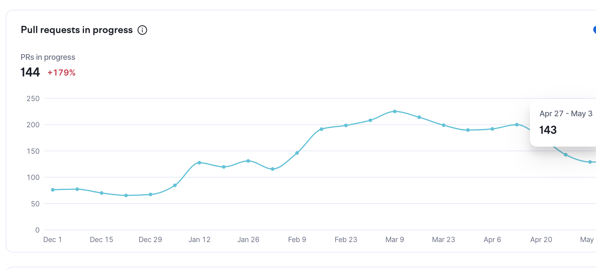
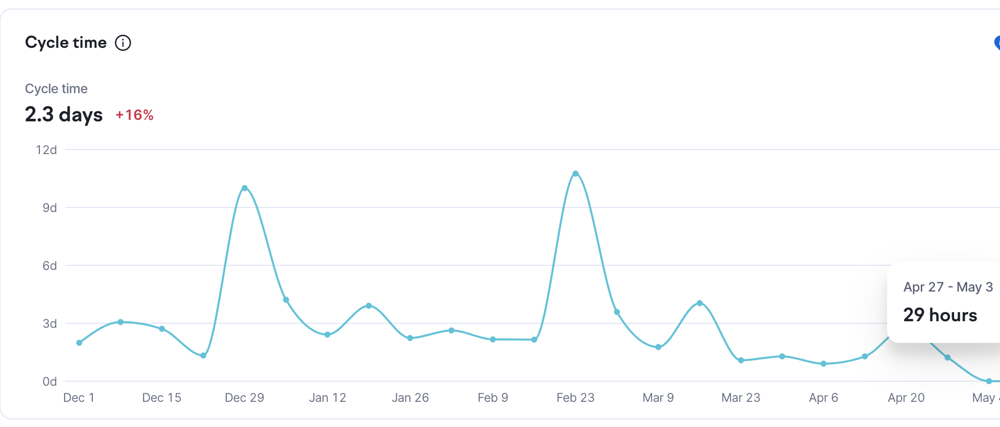

## Introduction

I've been working in the tech world since 2014ish. I've been a sysadmin, backend developer, devops engineer, platform engineer, cloud engineer, and site reliability engineer. I've worked for very large companies like Capital One and Cloudera. I've worked for very small companies like Anomalo. I've worked on individual pet windows servers and massive cattle container farms. I have helped rack and stack servers and  I've helped people move away from SVN, manually copying war and jar files onto tomcat servers manually to ship software, and copying files onto S3 to deploy a website. I generally feel like I've seen most types of software development practices good and bad. And using Coding Agents represents fundamental shifts in a few ways and in many others it means no changes.

About 3 months ago Anomalo embarked on a project called AI Sensible Defaults. The project was meant to help the engineering org figure out how we should be using LLMs, where our processes were deficient, what needed to change, and where was inappropriate to use LLMs. It also expanded into building [Gravity](https://knechtions.com/building-claude-agents/). Anomalo has been using LLMs for a while, but in the last 3 months has kicked it into high gear pushing extremely fast and increasing throughput massively. From 150 prs a week to more than 500 prs. From a human approval rate of 100% to right around 30%. We have seen the Cycle Time go down. We have seen PRs in progress go down. And we haven't seen an increase in incidents or patches per PR (We've actually seen this go down).

The following list is not comprehensive, nor do I claim we or I have all the answers, but the following represent a list of meaningful differences that I have observed, actions implemented, and lessons learned.

Note: Throughout the article I will refer to actors. Actors represent either a human or LLM who is writing code.

## Where Agentic Software Development Lifecycle Differs

First the differences.

1. Code Generation is cheap. Where as before code generation was at least a minimal blocker it is no longer so. That means that the overhead cost of iteration, which was already incredibly low in the software world compared to other disciplines of engineering, is basically 0.

2. Iteration times can go way down. Because code generation is so easy the ability to iterate is increased.

3. Burn out is real. It is very easy to feel an increased pressure to deliver because code generation is so easy. So if productivity is measured, explicilty or implicitly, in PRs landed or features "delivered".

4. Delivery is a lot faster. At Anomalo in the last 6 weeks we've seen a 2.5x increase in the number of PRs that are being merged with no increase in engineering head count and that number is likely still growing.

5. Non-Engineers can be empowered to deliver code and solve problems on their own. We have product, operations, sales, go to market, and basically every other role contributing to parts of Anomalo in the form of code assisted by Agents. This means that bugs or features that are small but otherwise straight forward to deliver but are low priority are able to be solved faster. Processes that otherwise lived in the form of documentation or knowledge in someones head is being written down and transformed into shareable and discoverable knowledge.

## Where Agentic Software Development Lifecycle is the same

Now, the similarities:

1. The chokepoints are the same as they always were. Before we had agents the biggest painpoint, in vitually every org I was in, was getting substantive feedback on PRs and proposals. This remains true in an agent assisted SDLC.

2. Generating code is still not the hard part. Generating code was never the hard part and so while it is easier to iterate, test, ship, and discard code, that was never actually the hard part. What was hard was figuring out the right problem to solve. Figuring out if and how we should solve it. Figuring out what is valuable to work on.

3. Tasks can be offloaded in parallel easily. I've only worked at one or two orgs in my career that have had the ratio of junior engineers to senior engineers to allow for offloading of repetitive or menial work to junior engineers for their edification. With coding agents I can do that in parallel in a way that otherwise wasn't possible. This has a meaningful difference in speeding up senior+ engineers.

4. Having non-engineers contribute large features or new apps carries the same risk and issues that Shadow IT has always carried. The difference now is that when they come to us they have an entire app or agent that has been vibe coded and we then have to help them productionize it and prioritize that work against our own.

## How this has changed how I work and the engineering processes at Anomalo

These changes are meaningful. Especially at an org of only 20ish very senior engineers like Anomalo. We can deliver a lot faster. We can pivot and change things a lot faster. And this means changes to the organizations and processes we use.

1. The bar for a Human to look and evaluate a PR is much higher. An agent or LLM is capable of evaluating risk and approval of low and very-low risk PRs. There is a signficant portion of the PRs that are shipped that are very low or low risk. A dependency upgrade that passes all our tests (Anomalo has >30,000 unit and integration tests that can be run against the product and so having a dependency upgrade break something and not be caught by a test is rare). A configuration change to a part of the code that isn't live yet. Refactoring code without changing the inputs and outputs. Adding new classes. Modifications to the internal saas platform. Modifications to our dev container setup. Any number of these that need some form of review but don't need a human to review them. These can be auto-approved after automated review. The LLMs are at least not worse at judging the risk of an individual PR. We tested this. We ran the risk-assessment LLM without being able to approve and compared to human approvals and risk assessments. In 7/8 cases we agreed with the risk assessment of the LLM. In the cases we disagreed it was about a 50/50 split on if we thought it was higher or lower risk.

2. Code Review tools are almost infinitely better at providing substantive feedback faster to a PR author than humans are. Humans, especially subject matter experts, are exceptionally good at providing feedback on initiatives and projects. However, the closer you get to the implementation code the fewer people in any given company are able to give substantive feedback. And very few, if any of them, will be human compilers to give you the level of review that an LLM can. This is true by virtue of how many people have touched any given piece of code. I've met many brilliant engineers in my time and if I gave most of them unfamiliar code they would be able to provide surface level feedback, they would be able to make sure I wasn't doing an N+1 query or exhausting the stack, but, and this is critical, it would take time and energy and break their flow state to do so. An LLM can do so almost instantenously. Anomalo trialed Greptile, Macroscope, Claude + prompt and eventually settled on Greptile. Every single engineer said that having the LLM give a review gave them better substantive feedback on the specific implementation than humans were giving them.

3. Human input and feedback on project or initiative level is more critical than ever. I have long been a fan of ownership of execution of a project or task by engineers. I have over my career lived by the mottos of "Code Talks" and "Ask forgiveness not permission". I want to be allowed to succeed and fail with my projects and make my own decisions about them. I don't like consensus building instead favoring a model where individuals are empowered to say, "I intend to do X" and then bear the consequences. This incentivizes them to get input from experts and stake holders without binding them to committees. LLMs are not a substitute for this. We have gravitated more and more towards having lots and lots of human review and discussion on the project level and less and less review of the individual PR as part of the implementation. I think this will continue to be the trend.

4. Everyone works differently with AI. Our VP of Engineering did a listening tour to talk to engineers and find out how they were using AI and the styles vary pretty strongly. Some do one shot methods of asking the AI to do a thing and then review after. Others spent a lot of time in planning before implementation. There is no single style of interacting with LLMs that is universally better or worse on an individual level any more than there is no one method of building a company, team, or engineer.

5. A lot more of all types of tasks are being done. I mentioned that Anomalo had seen a 2.5x increase in the number of PRs being shipped. When we did classification of those we saw that it wasn't just features being shipped. the number of refactors, bug fixes, documentation updates, security fixes, etc had all increased in volume (without changing drastically in percentile make-up). LLMs are making us better at shipping more things. And a lot of things that otherwise would take time. I can use our internal agent platform to kickoff a dependency upgrade from slack, get back a PR a few moments later that has passed linting, local checks, and is in draft waiting for my review generated by the LLM. All without breaking focus, swapping my branch, etc.

6. The number of bug fixes haven't gone up. We have examined the rate of patches or cherry-picks that we make per PR and it has remained reasonable constance for the last 9 months. We are making more patches. However, that is driven primarily by the number of PRs, not by adding agents. This means that at least so far the human agent combination hasn't cuased a shift in measurable quality.

7. What used to be tribal knowledge is being written down. An interesting side effect of agents is you cannot make them effective without creating documentation. And this is not true of humans. With humans you can sit in a meeting and share context. You can have a water cooler chat. Agents don't have that. Even if you use a microphone and speak to the agent a written record is retained. And inevitably the human will get annoyed having to repeat themselves so will, either themselves or via agent proxy, write down how a process is supposed to work, what a component or service does, etc. This is inevitable and makes future actors better.

8. Documentation rot is real and requires curation and deletion. Will Larson writes about this in [Refactoring Internal Documentation at Notion](https://lethain.com/refactoring-internal-docs-notion). LLMs will find the one outdated piece of documentation that exists somewhere that someone forgot to update. Keeping them up all up to date is critical and pruning what isn't needed anymore is also important.

9. Guardrails cannot be honor, or competency, or tribal knowledge. One of the most critical lessons I've seen and observed is that where as before a guardrail or piece of feedback could be communicated via PR comments or in a slack thread, and that was good enough because the rate of change was slow enough it was only relevant every now and then, now it must be written down or codified. Linter configuration, Linting at all, rules engines like OpenPolicyAgent or Kyverno for infrastructure, Style guides and their enforcement, best practices, feedback, all of it now needs to be written down. And this was true before as well, really. It is just that the rate of change compared to the effort to write it down rarely favored the effort. That is no longer true. In order to keep a handle on the code base you must write down and critically, enforce through declarative means, the rules you want actors in your codebase to follow.

10. TDD and Shift Left (from the DevOps movement) are being re-learned. TDD because this is the method of forcing agents to write to a spec. Defining upfront what the outcomes we want via declarative methods, especially when reviewing architecture inputs as humans, is critical. Shift Left because LLMs are not running on your local machine, neither is Claude Code nor are tools like Kelos. At least at Anomalo we've been increasingly reliant on CI to validate. However, this is 1) expensive and 2) much slower than running locally. An example here is specific review agents. Imagine having an LLM acting as a DBA reviewer for SQL migrations. If that only runs when you have pushed the PR we have extended the feedback loop massively. The end state goal, similar to the rest of CI, will be to having these review agents run locally as an actor is writing code to provide live feedback. This is equivalent to having constantly running tests locally telling you when something breaks or passes.

There are likely other changes coming. We've not reached the end of the LLM assisted journey. We don't know where the models will plateau. It could be in two weeks or it could be years from now. And I have a feeling we will increasingly discover that the Agent Assisted SDLC is really just the SDLC taken to the extreme which means that your processes and procedures need to be ready for that. What previously you might have to change as the organization grows from 10 -> 50 -> 300 -> 1000 and beyond now can happen when you are only 20 engineers. What was once sustainable at 5 engineers no longer is so.
