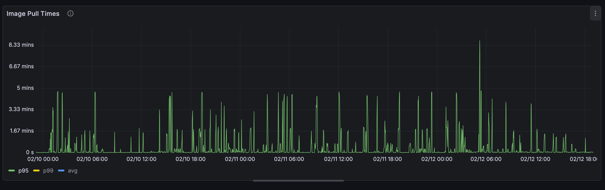
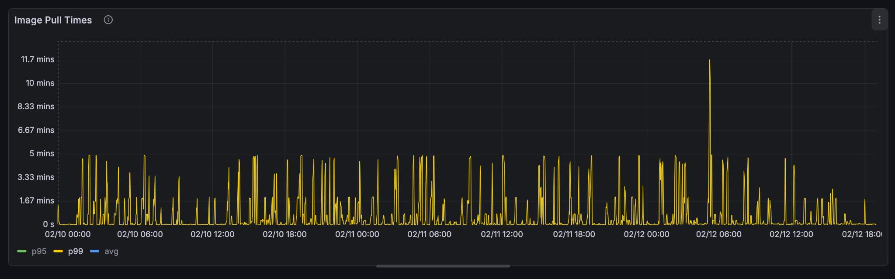
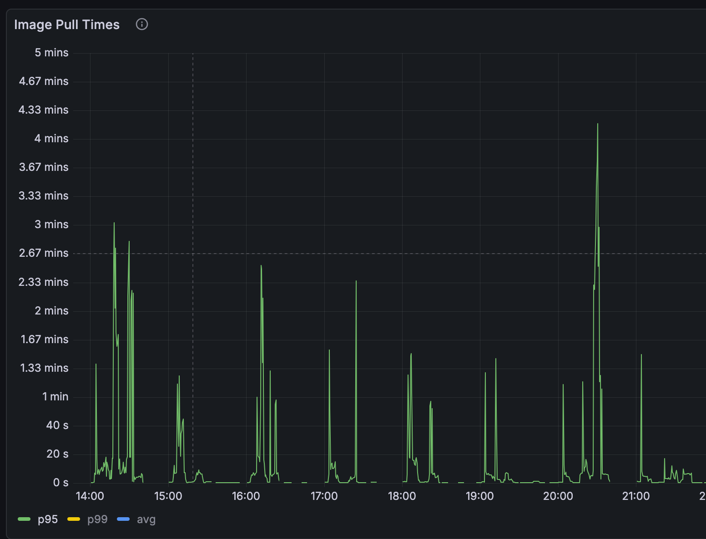
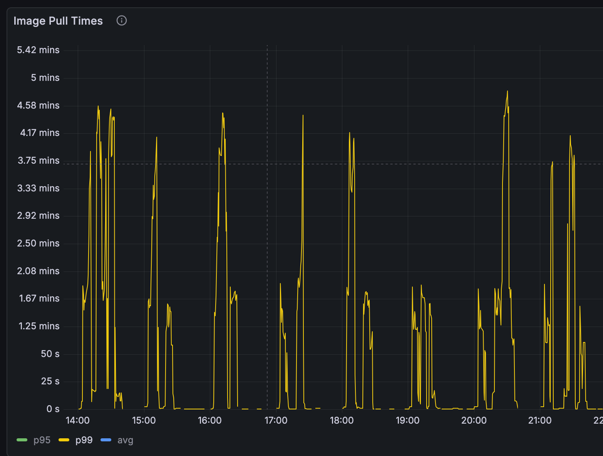
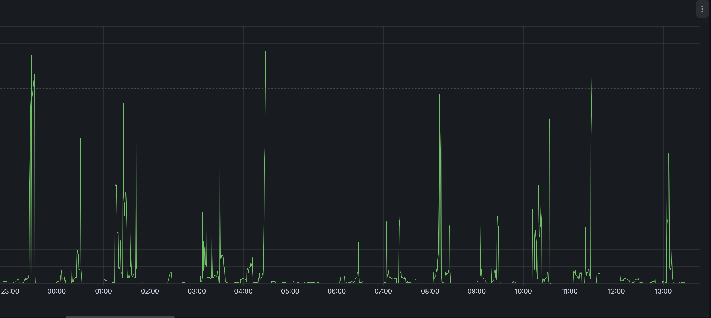
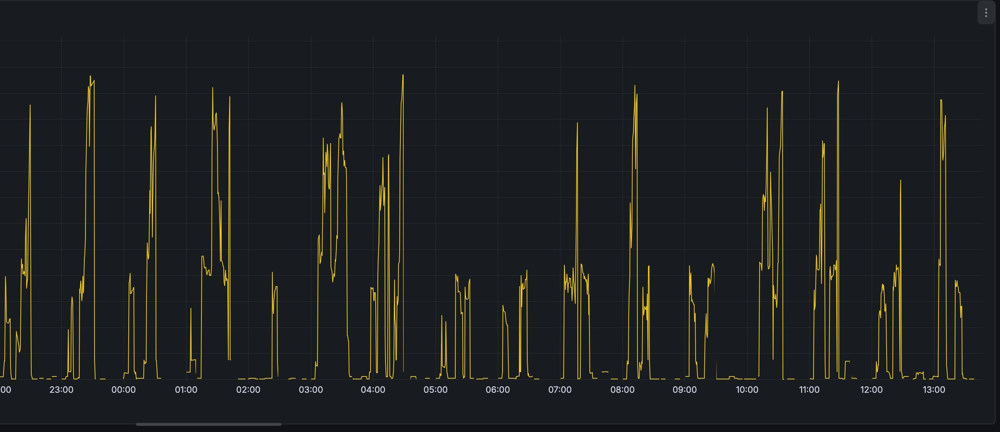

## Introduction

I recently had the opportunity to dig into improving container image pull speeds in Kubernetes clusters in Azure and AWS. The application in question has an image that is around 3Gb compressed and 9Gb uncompressed because it has custom machine learning models.

The investigation was spawned because we noticed a long container start time that was negatively impacting the customer experience in processing work. If the customer expected something to process within 10 minutes, but we spent 5 minutes pulling the image and 3 minutes decompressing it, then we only had 2 minutes left to do the work.

The first thing to do is measure the problem.

I put together a panel in Grafana that measured:

```
histogram_quantile(
  0.99,
  sum by (le,cluster) (
    rate(kubelet_runtime_operations_duration_seconds_bucket{operation_type="pull_image"}[5m])
  )
)
```

and

```
histogram_quantile(
  0.95,
  sum by (le,cluster) (
    rate(kubelet_runtime_operations_duration_seconds_bucket{operation_type="pull_image"}[5m])
  )
)
```

This gives us a measurement of the worst offenders. Unfortunately the kubelet_* metrics don't break down by namespace, but for this purpose that was okay because the clusters were uniformly either core applications (like cert-manager) or these large images.

p95 and p99 image pull times for these large images was just under 5min as measured. This was our metric to improve.

I had a lot of free reign to how to improve it - I could add new components to the cluster, modify nodes, etc. However, I wanted to focus on something maintainable, something that worked with the node operating systems, and worked within the existing processes.

## Technical Constraints

There are a few key pieces of technical constraints that introduces:

1. We didn't currently build a custom AMI. This means unless I really, really have to I don't want to introduce that into the process.
1. In AWS the base EKS node uses bottlerocket and in Azure the base AKS node uses AzureLinux. I'm not strictly limited to using these two OSes, but if I move off of them, I need a really good reason to. It would change things like node start-up time, security posture, and a lot more overall configuration.
1. Floating tags are used. While @latest isn't used tags that correspond easily to versions are. I need something that can handle looking at digests not tags.
1. Tools like [keel](https://keel.sh/) need to work. Because we use floating tags, ensuring rollouts are not random is important. Tools like keel are used to help ensure we stay on a schedule and rotate at pods roughly in concert.
1. but if I move off of them, I need a really good reason to. It would change things like node start-up time, security posture, and a lot more overall configuration.
1. We needed something that worked in our cloud/saas environments but also in customer environments for self-hosted without significant deviations/complexity.

## Previous Optimizations

The primary previous optimization we had already made in this area were regional endpoints and registries. In AWS, we use ECR endpoints local to the vpc the nodes are in and pull from an ECR registry that is local to the region. In Azure, we use an ACR registry that lives in the same region as the AKS nodes. These (changes?), despite storing the same image duplicitively, was a big cost savings measure because of data transfer costs pulling from a centralized repo.

## Exploration of Options

There's not a ton of literature on optimizing in this situation. It is only in the last few years that container images have both gotten this big AND images of this size matter for customer experiences.

There were a few avenues and tools to explore:

### Pre-warming images

Pre-warming means pulling the container image before you need it. This could be at any number of moments:

- Pre-Node Boot
- Node boot
- Image build
- On Image push

Here I found a reasonable amount of guidance.

1. [There's a nice thread on bottlerocket's github about using an EBS volume with the container images needed for a node](https://github.com/bottlerocket-os/bottlerocket/discussions/2023), also an [article from AWS](https://aws.amazon.com/blogs/containers/reduce-container-startup-time-on-amazon-eks-with-bottlerocket-data-volume/). However, the image injected is too stale for us. The images that are large for us contain models that change and cythonized python code. Both of which means that any EBS volume we snapshot would only share some of the layers with the ones pulled at container start.

2. [AWS has guidance on using SSM and eventbridge to fetching images on container push](https://aws.amazon.com/blogs/containers/start-pods-faster-by-prefetching-images/). While this is AWS specific, we could build something similar in azure land, or cross cloud, for example a daemonset that runs on every node, looks for image updates, and then executes image pulls. This solution would be inefficient, pulling lots and lots of releases that may not land in that specific environment, and means we need to adjust image pruning, how much disk we have on the node, etc. Possible, but not my first inclination.

3. [The Node Readiness Controller, which is very cool, allows you to pre-fetch images on node boot](https://kubernetes.io/blog/2026/02/03/introducing-node-readiness-controller/). While an awesome new project, and something we'll use for other parts of our stack, doesn't help here because it moves the time spent waiting from container start to node start.

### Pull Optimizations

There's less guidance here. There are some cool tools I will talk about, like Dragonfly, Spegel, and Kraken, and some OS optimizations that can be done.

First, tooling:

We have 2 different types of tooling available to us here:

P2P Tooling ([DragonFly](https://d7y.io/), [Spegel](https://spegel.dev/), [Kraken](https://github.com/uber/kraken/)), and parallel pull tooling ([stargz](https://github.com/containerd/stargz-snapshotter)).

For the P2P tooling, we have tools that fall into two camps: tools that modify the ContainerD config directly (Spegel and DragonFly) and tools that run node local container registries for optimized caching (Kraken). I ran into my first big issue at this point. Bottlerocket doesn't allow for configuration of those ContainerD settings[[1](https://github.com/spegel-org/spegel/issues/47)][[2](https://github.com/bottlerocket-os/bottlerocket/issues/1963)]. So onto Kraken. Kraken works by deploying a node local contianer cache that then uses the other nodes as peers and the upstream registry to optimize container pulls.

However, we run into our second problem here. Spegel and Kraken both don't support floating tags very well. They both [recommend](https://spegel.dev/docs/guides/updating-latest-tag/) deploying something like Kyverno or k8s-digester to mutate pods from floating tags to digests. That's not a massive deal, but a little annoying. DragonFly gets around this by only operating at the digest layer. Rather than intercepting the whole image pull, it intercepts only the layer requests.

#### DragonFly

DragonFly was our first option. I wanted to see if I could get it to work on our Azure clusters to see what kind of performance gains we would see. Unfortunately, I was unable to get it to actually run. See, Azure, like Bottlerocket, doesn't expose all the containerD options. However, they have a slightly terrifying and novel solution of... just [modify containerD with a daemonset](https://learn.microsoft.com/en-us/azure/operator-nexus/howto-kubernetes-cluster-customize-workers). That was wild to discover. But this method could work, so I gave it a shot.

I was able to install the DragonFly helm chart and get it mostly up, but running the Dragonfly init container to modify the containerD daemon failed because it never got a response back because containerD was restarted. Kind of a chicken and egg problem. After about 3 days of messing with it, I swapped over to Kraken.

#### Kraken

I deployed out Kraken into one of our EKS testing clusters. This cluster has 5–6 complete running instances of the application at any given time and gets released to multiple times a day. This was a great cluster to test in. Getting it stood up wasn't terribly difficult, I just had to provide credentials to our private registry. Getting Kyverno stood up also wasn't hard, I've run Kyverno lots of times by now. The only slightly tricky part was writing the Kyverno policy. We needed the policy to keep the deployment image the same, but modify both the digest and the registry.

This meant Kyverno first had to look up the digest in the upstream registry (otherwise it would get the cached value local to the node) and then replace the registry with the node local kraken one:

```yaml
apiVersion: kyverno.io/v1
kind: ClusterPolicy
metadata:
  name: resolve-then-rewrite-ecr-to-local
  annotations:
    pod-policies.kyverno.io/autogen-controllers: "ReplicaSet"
spec:
  background: false
  rules:
    - name: resolve-and-rewrite
      match:
        any:
          - resources:
              kinds:
                - Pod
      preconditions:
        all:
          - key: "{{ request.operation || 'BACKGROUND' }}"
            operator: NotEquals
            value: DELETE
      mutate:
        foreach:
          - list: "request.object.spec.containers[?starts_with(image, '<private-registry>')]"
            context:
              - name: resolved
                imageRegistry:
                  reference: "{{ element.image }}"
                  jmesPath: resolvedImage
            patchStrategicMerge:
              spec:
                containers:
                  - name: "{{ element.name }}"
                    image: "{{ regex_replace_all('^<private-registry>', resolved, 'localhost:30081/') }}"
```

After a few hours of messing with the policy to get it to do what I wanted, I shipped it into the test cluster.

Images still pulled, Kraken was serving them, and I could see the P2P connections. Awesome. I decided to let it run for 48 hours to see the results.

Here's the graph. Kraken was turned on on 2/10





Imagine my surprise when… image pull times appear to have gotten worse. Not statistically significantly worse, but just looking at the graph you can see that we had a lot more long pull times in both p95 and p99.

I actually don't know why. Still don't. My best guess is that because of the node local registry the decompression time goes up.

See the Kubelet metric doesn't break down the network calls from the decompression. [EC2 Networking is symmetrical upload and download](https://docs.aws.amazon.com/AWSEC2/latest/UserGuide/ec2-instance-network-bandwidth.html). If we already had maxed out our download speed talking to ECR, and decompression time goes up because of the node local cache kraken introduces (nginx), then we would see a more erratic pattern and higher p99 and p95 times.

#### Parallel Image Pulls (SOCI)

The next improvement one can look at is the ability for parallel image pulls. Both [Azure](https://learn.microsoft.com/en-us/troubleshoot/azure/azure-kubernetes/availability-performance/container-image-pull-performance) and [AWS](https://aws.amazon.com/blogs/containers/introducing-seekable-oci-parallel-pull-mode-for-amazon-eks/) support seekable OCI parallel image pull.

In Azure enabling it is relatively easy. [Happens on the Container Registry](https://learn.microsoft.com/en-us/troubleshoot/azure/azure-kubernetes/availability-performance/container-image-pull-performance).

I turned it on, let it run, and... No difference

Before:





After:





In AWS, however, [it was more complicated](https://aws.amazon.com/blogs/containers/introducing-seekable-oci-parallel-pull-mode-for-amazon-eks/). In order to support it [we needed to enable soci as the snapshotter](https://bottlerocket.dev/en/os/1.53.x/api/settings/container-runtime-plugins/) and then tune it for parallel pulls.
...
