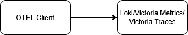
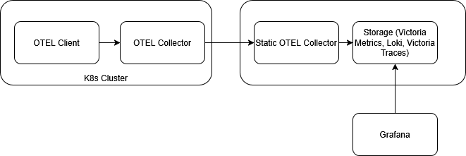

## Introduction

The goal of observability is to separate the signal from the noise. Two things are true about any distributed system: 1) some or all of it is running in a degraded state at any given moment 2) any collected data from it contains noise. Most of the time the noise represent normal and happy path events. Ideally, this is the vast majority of the observability data produced as it should represent the majority of interactions in and with the system. This means we need to filter out the noise to get to the signal. So we can see what and how things are broken and what someone can do about it.

Collecting observability data at any scale is fundamentally a data pipeline. It, frequently, represents one of the largest data pipelines that a company has and it is also one of the most critical. It is also generally true that engineering time is the most expensive part of maintaining systems. So getting the data pipeline correct from the beginning is critical to having a system that can scale without linear growth of engineers supporting it.

Open Telemetry (OTEL) represents an open standard for the collection of metrics, traces, logs, and other telemetry data; it also represents the ability to fundamentally control your entire observability pipeline without vendor lock-in. It works on a client → server architecture where you install an OTEL SDK or agent that runs alongside your code and uses either automatic and/or manual instrumentation to ship your data to a server to store for correlation and searching.

A primary benefit of OTEL is that by using the agent you can ship to any number of compatible backends, including Datadog, NewRelic, HoneyComb, GroundCover, the LGTM (Loki, Grafana, Tempo, Mimir) stack, and many more. This allows you to control how, where, and how much of your observability data ends up in a specific location thus giving us knobs to turn to make the data valuable and scalable.

Another primary benefit is the long list of tools that directly integrate or come with OTEL support built in. From container orchestrators like Kubernetes (k8s), to a variety of service meshes and networking tools (Istio, Linkerd, Cilium, Traefik, Istio Gateway); GitOps tools (ArgoCD, Flux), CI tooling (Github Actions, Buildkite, etc.) you can stitch together information about what is running in a variety of places.

The following represents learnings from running OTEL for the last ~5 years in environments dealing with up to ~1 Billion events per hour and ~10 TB of data collected on a rolling basis. I'd love to hear how and where you've seen different architectures work for you!

---

## Architecture

As previously described a traditional APM/Observability stack would look something like:



However, this falls apart in higher throughput environments as it means scaling your storage backend with little control of what is coming in. Prometheus, Loki, and Victoria(Metrics|Traces) provide some configuration around sampling or retention periods, but this has two primary downsides:

1. Because the storage is, in most cases, a shared multi-tenant environment the actions of one service or team can affect everyone's experience.

I've seen a variety of scenarios cause this:

- A service experiences a crash and starts spewing exponentially more logs/traces.
- A service adds a metric added with massive cardinality impacting cost or storage or query times.
- Debug mode is left one for a core piece of infrastructure (i.e. Istio/Linkerd)

2. You have to process and ship the data. Storage is rarely the most expensive part of the system. Rather the bandwidth and compute costs are the lionshare of the price which means that any processing that happens on the storage layer happens after all of the bandwidth and compute has been paid for.

In order to fully realize the benefits of )OTEL you shouldn't be shipping directly from the SDK to the final storage destination; but rather should have at least one (but I'll recommend at least two) layers of OTEL collectors in between.



In this pattern your client SDKs speak to an initial OTEL Collector. These should exist as close to your application/service/client as possible. For API services this may mean running in the same k8s cluster (or same node or as a sidecar if you want three layers of OTEL), or running somewhere publicaly accessible for mobile or browser telemetry events. If you are no using K8s to run your services then in the same region/availability zone is the best option. The goal here is to minimize the amount of time and effort it takes for your data to enter the data pipeline and minimize the amount of work that your client side SDK needs to do.

The initial layer of collectors should then ship to a group collectors with defined DNS names. This allows us to use the built in OTEL loadbalancing to ensure that ALL events that are part of the same event (i.e. spans that are part of the same trace) end up on the same secondary collector. These secondary collectors are where the data pipeline aspect really comes alive. Because when all of the related parts of an event are on the same collector OTEL can then effectively apply rules to decide when and whether to sample.

It is at this point you can choose to sample events based on the length of time they took, whether they represent an ERROR event, or even specific paths/or business critical events. The goal here is to separate the signals from the noise. Allowing teams and services to self-service what data they need to ultimately aggregate by defining a well-known set of rules for sampling and controlling the data.

---

## Practical Configuration

The config of this first collector would look something like this:

### Initial OTEL Collector Config

```yaml
# otelcol-gateway.yaml
receivers:
  otlp:
    protocols:
      grpc:
        endpoint: 0.0.0.0:4317
      http:
        endpoint: 0.0.0.0:4318

processors:
  memory_limiter:
    check_interval: 1s
    limit_mib: 1024
    spike_limit_mib: 256

  # Optional: normalize resource attrs, add cluster/env, etc.
  resource:
    attributes:
      - action: upsert
        key: deployment.tier
        value: "gateway"

  batch:
    send_batch_size: 8192
    timeout: 2s

exporters:
  # Load-balance TRACES by trace ID (consistent hash)
  loadbalancing/traces:
    routing_key: traceID
    protocol:
      otlp:
        tls:
          insecure: true
    resolver:
      dns:
        hostname: otelcol-worker-headless.observability.svc.cluster.local
        port: 4317

  # Load-balance LOGS. If logs have trace_id, they’ll be routed by traceID.
  loadbalancing/logs:
    routing_key: traceID
    protocol:
      otlp:
        tls:
          insecure: true
    resolver:
      dns:
        hostname: otelcol-worker-headless.observability.svc.cluster.local
        port: 4317

  # Load-balance METRICS by service (resource attribute).
  # Metrics don't have trace IDs; hashing by service.name spreads load.
  loadbalancing/metrics:
    routing_key: service
    protocol:
      otlp:
        tls:
          insecure: true
    resolver:
      dns:
        hostname: otelcol-worker-headless.observability.svc.cluster.local
        port: 4317

extensions:
  health_check:
    endpoint: 0.0.0.0:13133
  zpages:
    endpoint: 0.0.0.0:55679

service:
  extensions: [health_check, zpages]
  pipelines:
    traces:
      receivers: [otlp]
      processors: [memory_limiter, resource, batch]
      exporters: [loadbalancing/traces]

    logs:
      receivers: [otlp]
      processors: [memory_limiter, resource, batch]
      exporters: [loadbalancing/logs]

    metrics:
      receivers: [otlp]
      processors: [memory_limiter, resource, batch]
      exporters: [loadbalancing/metrics]
```

### Sampling OTEL Collectors Config

```yaml
# otelcol-worker.yaml
receivers:
  otlp:
    protocols:
      grpc:
        endpoint: 0.0.0.0:4317
      http:
        endpoint: 0.0.0.0:4318

processors:
  memory_limiter:
    check_interval: 1s
    # Tail sampling is stateful; size this based on peak traces-in-flight
    limit_mib: 4096
    spike_limit_mib: 1024

  resource:
    attributes:
      - action: upsert
        key: deployment.tier
        value: "worker"

  # Tail-based sampling (5 minute wait)
  # Key points:
  # - decision_wait controls how long spans are buffered before deciding
  # - all spans for a trace must land on the same instance (Tier 1 hashing)
  tail_sampling:
    decision_wait: 5m
    num_traces: 500000
    expected_new_traces_per_sec: 2000

    policies:
      # 1) Keep all error traces
      - name: keep_errors
        type: status_code
        status_code:
          status_codes: [ERROR]

      # 2) Keep traces with any span slower than 5s
      - name: keep_slow
        type: latency
        latency:
          threshold_ms: 5000

      # 3) Keep traces that hit /auth (match on common http attributes)
      # Adjust keys depending on your instrumentation (http.route, http.target, url.path, etc).
      - name: keep_auth_path
        type: string_attribute
        string_attribute:
          key: http.route
          values: ["/auth"]
          enabled_regex_matching: false

      # 4) Catch-all: 10% of the remaining traces
      - name: keep_10_percent_everything_else
        type: probabilistic
        probabilistic:
          sampling_percentage: 10

  # Logs: mirror the same intent.
  # - Always keep ERROR logs
  # - Always keep logs for /auth
  # - Keep 10% of the rest (consistent by trace ID when present)
  filter/logs_keep_important:
    logs:
      log_record:
        - 'IsMatch(severity_text, "^(ERROR|FATAL)$")'
        - 'attributes["http.route"] == "/auth"'

  probabilistic_sampler/logs_10pct:
    sampling_percentage: 10
    # for logs this can hash by trace ID (if present) or by a chosen attribute
    sampling_hash_seed: 22

  batch:
    send_batch_size: 8192
    timeout: 2s

exporters:
  # Example backends (swap to your real destinations)
  otlp/tempo:
    endpoint: tempo.observability.svc.cluster.local:4317
    tls:
      insecure: true

  otlphttp/loki:
    endpoint: http://loki.observability.svc.cluster.local:3100/otlp

  otlp/prom:
    endpoint: prometheus-remote-write.observability.svc.cluster.local:4317
    tls:
      insecure: true

extensions:
  health_check:
    endpoint: 0.0.0.0:13133
  zpages:
    endpoint: 0.0.0.0:55679

service:
  extensions: [health_check, zpages]
  pipelines:
    traces:
      receivers: [otlp]
      processors: [memory_limiter, resource, tail_sampling, batch]
      exporters: [otlp/tempo]

    logs:
      receivers: [otlp]
      processors: [memory_limiter, resource, filter/logs_keep_important, probabilistic_sampler/logs_10pct, batch]
      exporters: [otlphttp/loki]

    metrics:
      receivers: [otlp]
      processors: [memory_limiter, resource, batch]
      exporters: [otlp/prom]
```

Let's break down this config. This is where the magic lives. In this case I've told OTEL to ship every ERROR event, every event that has taken more than 5s to complete, events that happen to touch the path /auth and 10% of all other events. Assuming auth events are 1% of events, ERRORs are 1% of events, and 3% of events take more than 5s to complete we've managed to to shrink the amount of data from 100% → 14.5% (1 + 1 + 3 + 95 * .10)

In this case `/auth` represents a critical path request, but any path could be used.
This has allowed us to separate the signal from the noise. To our engineers and the final destination for our observability data there is significantly less data to parse and store.

Once it has arrived to your data store (Tempo, Loki, Elasticsearch, etc) you should almost certainly do more data processing. For example, perhaps you don't sample prod events at all, you sample all your non-prod.

In this scenario you may still want to avoid storing all the prod data indefinitely. So perhaps you separate log messages into different streams or indexes to allow for data expiration rules to be applied individually (e.g. DEBUG logs are expired after 24 hours, INFO after 7 days, WARNING and ERROR after 28 days).

You can go even further in the resiliency of your data pipeline and utilize a message queue such as Kafka or RabbitMQ to provide a decoupling between layers of OTEL or the SDKs. However, this adds far more operational complexity. Running a message queue without data loss is not always an easy task and working up to adding it, when OTEL Collectors already have an in memory queue to handle short downtimes, should be considered carefully.

---

### Autoscaling Collectors

There's an [incredibly useful article from OTEL](https://opentelemetry.io/docs/collector/scaling/) on how to scale the collectors and I recommend reading it to understand what metrics you want to observe and what metrics you want an HPA to work on.

If you are using the OTEL Collector chart then there is a [build in HPA](https://github.com/open-telemetry/opentelemetry-helm-charts/blob/main/charts/opentelemetry-collector/templates/hpa.yaml).

## Conclusion

Once you enter the OTEL ecosystem it is hard to be persuaded to leave it because of the features it provides. OTEL provides a rich eco system of plugins and collectors that serve a variety of needs. Besdies collecting your standard traces, metrics, logs, you can:

- [Collect K8s Events](https://github.com/open-telemetry/opentelemetry-helm-charts/blob/main/charts/opentelemetry-collector/values.yaml#L70)
- [Collect EBPF Based Network Information](https://github.com/open-telemetry/opentelemetry-network)
- [Collect Kubelet Metrics](https://github.com/open-telemetry/opentelemetry-helm-charts/blob/main/charts/opentelemetry-collector/values.yaml#L63)

And much more. OTEL, as a standard, is also seeing increased adoption across a variety of tooling and has replaced and consolidated access to observabilit data that didn't exist 7 or even 5 years ago.
